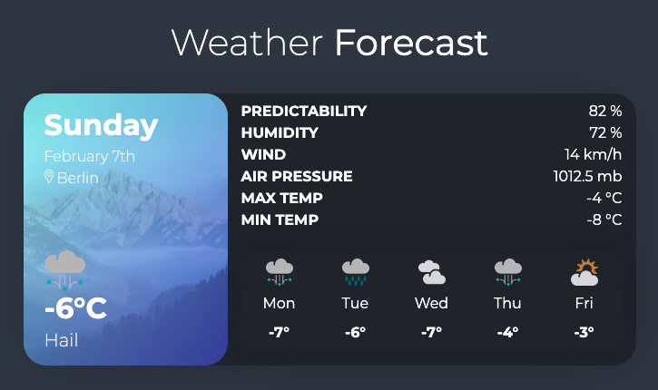

# 🌦️ Weather API


## Description

I built the weather app using javascript and ReactJS hooks, async/await as well as AXIOS and CSS modules!

Please see this app displayed on the page: [Weather App](https://weather-app-1804.vercel.app/)

---

## 👀 Preview



---

## 📚 Resources

* [Official API Docs](https://www.metaweather.com/api)
* [Async Await](https://developer.mozilla.org/en-US/docs/Web/JavaScript/Reference/Statements/async_function)
* [Axios](https://axios-http.com/docs/intro)
* [React](https://reactjs.org/)

---

### 💻 Tech stack 

```
Core:
- CSS Modules
- React.js
- Hooks

Communication tool:
- axios
```

---

## 🔎 Where can you find me?

<p align="center">
<a href="https://twitter.com/diacaroll" target="_blank">
    </a>
<a href="https://www.linkedin.com/in/diahan-hudgson/" target="_blank">
    </a>
<a href="https://diahancaroll.vercel.app/" target="_blank">    
    </a>
</p>